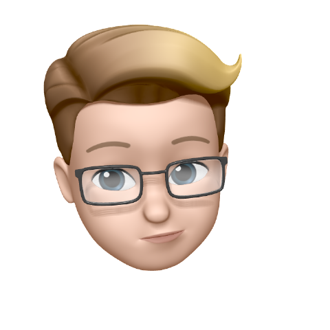

# Final Project

The final project of University of Central Florida's Data Science Bootcamp

## Meet the Team

 |  |  | 
-- | -- | -- | --
Francisco | Annie | Jovani | Max


---


This project will aim to create a model that can tell whether or not you have a face mask on. Inspired by the pandemic of 2020.
As shown above the project breakdown was simple. Use a cascade classifer to detect a face in a webcam window, extract the face and pass it to a convolutional neural network to classify the image as "no mask" or "mask".

The goal will be to add this model to the web and build a webapp that a user can use to check for a mask through their webcam. The model will also be able to predict a users age when they are not wearing a mask and use the latest data from the CDC to determine if they are at high risk for COVID-19.

Possible additional features may include the ability for the model to aid in giving the user an expected timeline for a vaccine to be available to them based on [this](https://www.nytimes.com/interactive/2020/12/03/opinion/covid-19-vaccine-timeline.html) vaccine tool from the New York Times.

## Environment

Included in our repository is our "requirements.txt" With this file in the repository, you can create the new environment by running:

```
python -m venv myenv
pip -r requirements.txt
```
## Technologies Used
* Python 3
* OpenCV
* Flask or Django (not sure which yet)
* Tensorflow/Keras
* SQLite, SQLAlchemcy, Monodb (not sure which yet)
* numpy
* HTML/CSS/Javascript

## Todo Checklist

A helpful checklist for the things that need to be accomlished:

- [x] Project Overview
- [x] The Week of December 9th deliverables
    - [x] Set up a group repository
    - [x] Create a project timeline
    - [x] Establish a comminucation protocol
    - [x] Decide which technoligies will be used
- [ ] Add ML-Model and venv
- [ ] Begin work on front end
- [ ] Create a branch for each team members features

