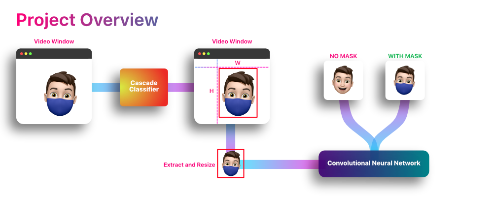

# Masky

> Facts on combatting community transmission

## Overview
### Vision
To provide the most convincing web app and data experience to show the effectiveness of masks during the COVID-19 global pandemic.
### Mission
To help prevent the spread of COVID-19 and convince more people to wear masks.
### General Overview

Inspired by the COVID-19 pandemic, this project will aim to create a model that can tell whether or not a person has a face mask on. Additionally, we will create a dashboard that will provide general COVID-19 information as well as information regarding the positive outcomes of using masks. 


Our model uses a cascade classifier to detect a face in a webcam window. It then extracts the face and passes it to a convolutional neural network to classify the image as "no mask" or "mask".

Possible additional features may include the ability for the model to aid in giving the user an expected timeline for a vaccine to be available to them based on [this](https://www.nytimes.com/interactive/2020/12/03/opinion/covid-19-vaccine-timeline.html) vaccine tool from the New York Times.
### Questions
What will this model accomplish overall?

How will it be used to assist in reducing the spread of COVID-19?

Are there specific locations where this model may be more helpful than others?
## Meet the Team

 |  |  | 
-- | -- | -- | --
Francisco | Annie | Jovani | Max

## Communication

We will communicate through:
- Slack
- Zoom meetings
- Google Drive
- Detailed Git commits
## Project Structure
```
.
├── projects
│   ├── app
│   ├── mask-api
│   ├── mask-dashboard
│   └── mask-model
├── resources
│   ├── annie.png
│   ├── cisco.png
│   ├── jovani.png
│   └── max.png
└── README.md
```

## Technologies Used

- Python 3
- Javascript, HTML, CSS
- Numpy, Tensorflow, Keras, OpenCV
- React, D3.js, Bootstrap
- Flask, SQLAlchemcy, PostgreSQL, MongoDB

## Links
[Google Slides Presentation](https://docs.google.com/presentation/d/1S5fD1oc8D6zi-y68vAaV90hLQpB2K51Yafq7mcVlOjc/edit?usp=sharing)

## Todo Checklist

A helpful checklist for the things that need to be accomlished:

- [x] Project Overview
- [x] December 9th deliverables
    - [x] Set up a group repository
    - [x] Create a project timeline
    - [x] Establish a comminucation protocol
    - [x] Decide which technoligies will be used
    - [x] Add ML-Model and venv
    - [x] Begin work on front end
    - [x] Create a branch for each team members features
- [x] January 10th Deliverables
    - [x] Presentation Drafted
    - [x] Code is production ready
    - [x] Fully integrated database
- [ ] January 17th Deliverables

